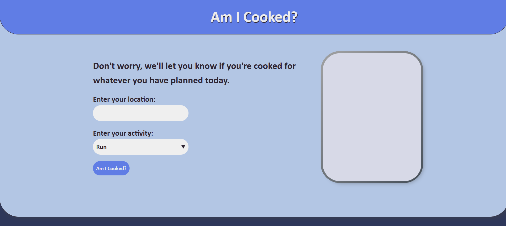
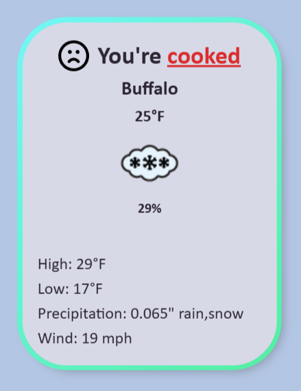
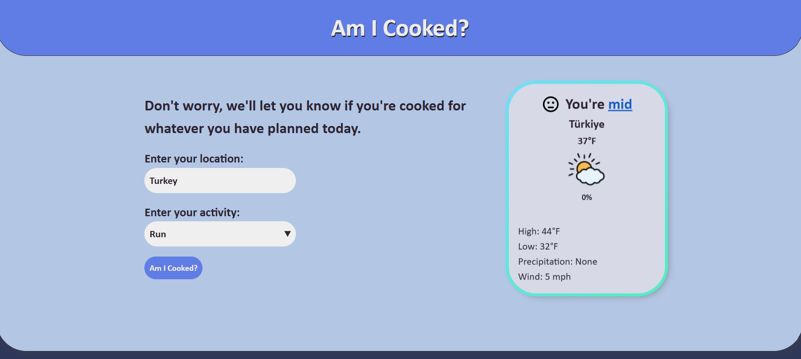
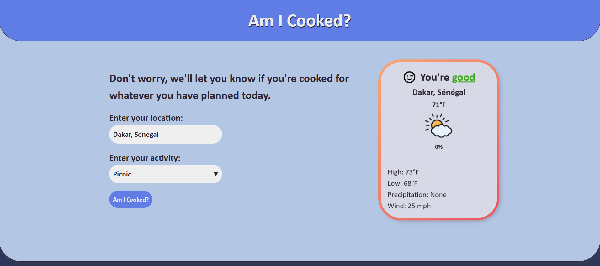

# :sunny: Am-I-Cooked? :umbrella:

    

## Table of Contents

-   [About](#about)
-   [Installation / Website Demo](#installation--website-demo)
-   [Tech Stack](#tech-stack)
-   [Features](#features)
    -   [Weather Metrics](#weather-metrics)
    -   [Activity-Based Rating](#activity-based-rating)
-   [Gallery](#gallery)
-   [Credit](#credit)

## About

Am I Cooked? is a lightweight, web-based weather readiness checker that helps users determine whether current outdoor conditions are suitable for a chosen activity. By combining real-time weather data with activity-specific thresholds, the application produces a clear, human-readable verdict: Good, Mid, or Cooked.

Users enter a location and select an activity such as Basketball, Picnic, or Running. The app fetches regional weather data using the Visual Crossing Weather API, displays relevant metrics, and applies custom logic to evaluate how favorable the conditions are for that activity.

This project was built entirely with HTML, CSS, and vanilla JavaScript to demonstrate knowledge of fundamental web technologies and API integration without the use of frameworks.

## Installation / Website Demo

The website is hosted online, and can be accessed below:

[Am I Cooked?](https://gaberashko.github.io/am-i-cooked/)

Otherwise, the project can be run locally with the following steps:

1. Download the repository.
2. Extract the repository.
3. Locate `index.html` within the project folder.
4. Open `index.html` in your browser.

> No build tools or dependencies are required.

## Tech Stack

-   HTML5 - Semantic structure and accessibility.
-   CSS3 - Responsive layout and visual styling.
-   JavaScript (ES6+) - Application logic and API handling.
-   Visual Crossing Weather API - Real-time weather data.

## Features

The application focuses on providing clear, actionable feedback based on real-world weather data.

### Weather Metrics

For the selected location, the application displays:

-   Current temperature
-   Daily high and low
-   Precipitation amount
-   Wind speed

These values are pulled in real time from the Visual Crossing Weather API and updated dynamically on user input.

### Activity-Based Rating

Each activity uses tailored evaluation logic to determine suitability based on weather conditions:

-   **Good** - Ideal or comfortable conditions
-   **Mid** - Acceptable, but not optimal
-   **Cooked** - Poor or unfavorable conditions

The rating system takes into account factors such as temperature extremes, wind speeds, and precipitation amounts to provide an intuitive final verdict.

## Credit

Weather data provided by the Visual Crossing Weather API.
UI icons and assets are either custom-made or sourced from open-license libraries.

---

### Enjoy! :white_check_mark:

[Back to Top](#table-of-contents)
